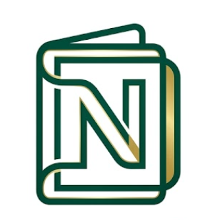
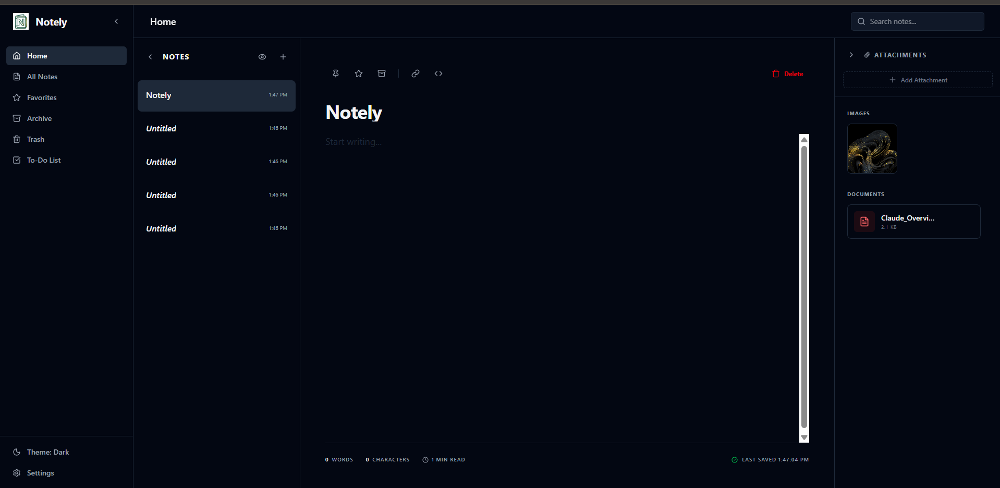

<div align="center">
  

  # Notely

  > **A modern, offline-first note-taking application built for speed, privacy, and productivity.**

  [](https://github.com/karalapatiphanicharan-cyber/Notely)
  [](https://github.com/karalapatiphanicharan-cyber/Notely)
  [](https://github.com/karalapatiphanicharan-cyber/Notely)
  [](https://github.com/karalapatiphanicharan-cyber/Notely)
  [](https://github.com/karalapatiphanicharan-cyber/Notely)
  [](https://github.com/karalapatiphanicharan-cyber/Notely)

  <br />

  

  *Notely Home Interface*
</div>

---
## 🌐 Live Demo

https://notely-seven-phi.vercel.app

## 📖 About Notely


Notely is a modern, privacy-focused note-taking application designed for the speed of thought. Built with an **offline-first** architecture, it ensures your data is always accessible and secure. By storing everything locally in your browser using **IndexedDB**, Notely eliminates the need for mandatory cloud accounts or external servers, putting you in complete control of your information.

Whether you're jotting down quick ideas, managing complex to-do lists, or organizing project attachments, Notely provides a clean, minimalist, and distraction-free environment to keep you productive.

---

## ✨ Features

| Feature                         | Status |
| ------------------------------- | ------ |
| 📝 Notes Management             | ✅      |
| 🔍 Fast Search                  | ✅      |
| ⭐ Favorites                     | ✅      |
| 📦 Archive                      | ✅      |
| 🗑️ Trash                       | ✅      |
| 📷 Image Attachments            | ✅      |
| 📄 PDF Attachments              | ✅      |
| 📋 To-Do Lists                  | ✅      |
| 🔒 Privacy Mode                 | ✅      |
| 🌐 Offline Support              | ✅      |
| 📱 Responsive UI                | ✅      |
| ⚡ PWA Installable               | ✅      |
| 💾 IndexedDB Storage            | ✅      |
| 🎨 Dark / Light / System Themes | ✅      |

---

## 📸 Screenshots

### Home Dashboard
The central hub for all your notes, featuring a four-panel layout for easy navigation, editing, and attachment management.


---

## 🛠️ Technology Stack

Notely is built using a modern, performant, and reliable tech stack:

*   **Frontend:** [React 19](https://reactjs.org/)
*   **Language:** [TypeScript](https://www.typescriptlang.org/)
*   **Styling:** [Tailwind CSS v4](https://tailwindcss.com/)
*   **Build Tool:** [Vite](https://vitejs.dev/)
*   **State Management:** [Zustand](https://github.com/pmndrs/zustand)
*   **Local Database:** [IndexedDB](https://developer.mozilla.org/en-US/docs/Web/API/IndexedDB_API)
*   **Offline Capabilities:** [Progressive Web App (PWA)](https://web.dev/progressive-web-apps/)
*   **Icons:** [Lucide React](https://lucide.dev/)

---

## 🚀 Installation & Setup

Get Notely running locally in just a few steps:

1.  **Clone the repository:**
    ```bash
    git clone https://github.com/karalapatiphanicharan-cyber/Notely.git
    cd Notely
    ```

2.  **Install dependencies:**
    ```bash
    npm install
    ```

3.  **Start the development server:**
    ```bash
    npm run dev
    ```

---

## 🏗️ Build for Production

To create an optimized production build, run:

```bash
npm run build
```

The output will be generated in the `dist` directory, ready to be hosted as a static site.

---

## 🌐 Deployment

Notely is a fully static application and is perfectly suited for modern hosting providers like **Vercel**, **Netlify**, or **GitHub Pages**.

### Deploying to Vercel
1.  Push your code to GitHub.
2.  Import your repository into Vercel.
3.  Vercel will automatically detect the Vite project and deploy it.

---

## 💡 Project Highlights

*   **Offline-First:** Your notes are available even without an internet connection.
*   **Privacy-Focused:** No trackers, no mandatory sign-ins, and no automated data uploads.
*   **Local Storage:** High-performance data management directly in your browser.
*   **Minimalist Design:** A distraction-free UI that focuses on your content.
*   **Instant Startup:** Optimized build for rapid loading and smooth interactions.

---

## 🔒 Privacy

All notes, attachments, and application data are stored locally in the user's browser using **IndexedDB**. No mandatory cloud storage or external synchronization is required. Your data never leaves your device unless you explicitly export it.

---

## 🔗 View on GitHub

Explore the full source code and contribute to the project:

[https://github.com/karalapatiphanicharan-cyber/Notely](https://github.com/karalapatiphanicharan-cyber/Notely)

---

<div align="center">
  Built with ❤️ for productivity, privacy, and offline-first note taking.
</div>
